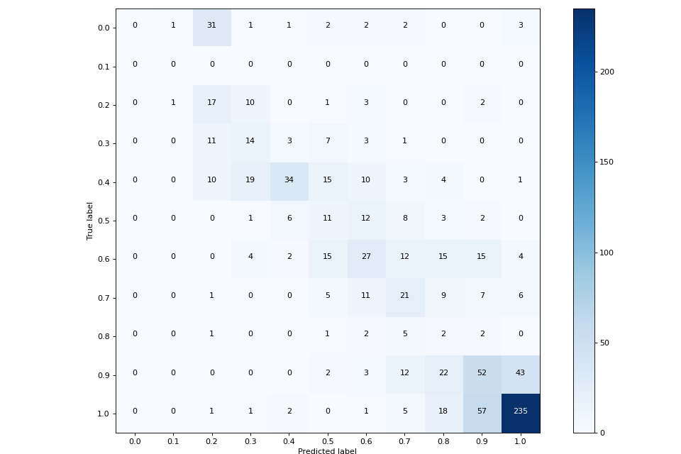

# Три задачи по компьютерному зрению
В данном репозитории представлены решения по трём задачам компьютерного зрения: одной задачи регрессии и двух задач создания бинарной маски классов.

## Краткое описание результатов
### Задача 1
Задача регрессии, предсказание параметра alpha объекта.  
Оценка точности ответов модели:  
| Model | MSE |
| --- | --- |
| **Unet_Encoder** | **0.024** |

### Задача 2
Задача генерации маски повреждения на листьях.  
Оценка точности ответов моделей:
| Model | Accuracy | F1 | Jaccard Index |
| --- | --- | --- | --- |
| Unet_300 | 0.86 | 0.57 | 0.40 | 
| **Unet_500** | **0.87** | **0.60** | **0.44** | 
| ViT_300 | 0.85 | 0.39 | 0.24 | 

### Задача 3
Задача генерации маски межклеточного пространства.  
Оценка точности ответов модели:
| Model | Accuracy | F1 | Jaccard Index |
| --- | --- | --- | --- |
| **Unet** | **0.95** | **0.9** | **0.82** | 

## Стек технологий
Все три задачи решены с помощью нейронных сетей, написанных на *`PyTorch`*. Обучение обёрнуто в *`Lightning`*, в качестве менеджера гиперпараметров используется *`Hydra`*, логирование производилось на платформу *`Weights and Biases`*.  
Для обработки изображений использовался *`Albumetations`*.  
Для менеджмента зависимостей библиотек использовался *`Poetry`*.

## Задача 1. Лейблинг объекта
### Краткое описание задачи
В датасете каждому объекту соответствует некоторый параметр *alpha*. Необходимо обучить модель, которая сможет сопоставить аналогичному объекту значение *alpha*.

Пример входного изображения с bbox объектов и указаннымии рядом значениями *alpha*:

### Способ решения
Первоначальный анализ объектов наводит на мысль, что от цвета "пирамидки" зависит значение alpha, которое нам необходимо предсказать. Чем темнее объект - тем больше значение alpha вплоть до 1.0.

Также заметим, что некоторые объекты находятся в очень плотном собрании пирамидок на небольшом пространстве, что усложняет анализ. Объекты часто перекрываются, "наезжают" друг на друга, иногда объект находится "на заднем плане" и еле различим в скоплении.

Пример "светлого" объекта со значением alpha = 0.3, которого частично закрывает "тёмный" объект со значением alpha = 1.0:

В качестве модели возьмём первую часть от модели с архитектуры Unet - конкретно, его Encoder-часть, и немного изменим "голову" модели, вместо Decoder-части вставив два MLP-блока, для решения задачи регрессии.  
Параметры у модели возьмём следующие:

| Parameter | Value |
| --- | --- |
| Encoder channels | [3, 8, 3, 1] |
| Head MLP_1 | [690, 256, 128] |
| Head MLP_2 | [128, 16, 1] |
| Head droprate | 0.05 |

Архитектуру модели можно посмотреть в файле [simple_model.py](images_segmentation/models/simple_model.py).

### Результаты
Прогонку обучения со всеми метриками на различных эпохах обучения можно посмотреть на платформе [WandB](https://wandb.ai/lost_in_thoughts/images_seg1).

Оценка точности ответов модели:
| Model | MSE |
| --- | --- |
| **Unet_Encoder** | **0.024** |

Модель выходит на "плато" функции потерь уже к 10 эпохе. Модель ошибается в среднем на 0.16 при определении значения alpha.

Для большего понимания, в чём проблема модели и где именно она ошибается, построем матрицу ответов модели:

Видно, что модель неплохо определяет высокие значения alpha, около 1.0. Однако маленькие значения она определяет намного хуже. Вероятно, это связано не только с сильно меньшим количеством примеров таких объектов, но и тем, что такие объекты достаточно частно могут перекрываться другими, более тёмными объектами (как показано в примере выше), что может сильно сбивать модель.

## Задача 2. Сегментация поражений листьев растений
### Краткое описание задачи
В данной задаче необходимо по изображению с листочком сгенерировать маску, в каком месте листочек уже испортился (сгнил, покрылся пятнами, иные дефекты).

Пример входного изображения, ground true маски:

### Способ решения
Задача решалась с помощью свёрточной модели Unet со следующими параметрами:

| Parameter | Value |
| --- | --- |
| Encoder channels | [3, 16, 32, 64] |
| Decoder channels | [64, 32, 16, 1] |

Граница ответа модели Unet, после которой принимается решение об 1 или 0 в окончательном ответе-маске, является `0.35`.

Всего параметров: 117K (0.47 Mb).

Архитектуру модели можно посмотреть в файле [unet.py](images_segmentation/models/unet.py).

Также было попробовано и использование совершенного другой архитектуры: Visual Transformer (ViT), слегка доработанный для построения маски-ответа.
ViT обучался со следующими параметрами:

| Parameter | Value |
| --- | --- |
| in_channels | 3 |
| image_size_h | 300 |
| image_size_w | 300 |
| patch_size_h | 30 |
| patch_size_w | 30 |
| layers | 6 |
| heads | 12 |
| embedding_dim | 768 |
| mlp_ratio | 4 |
| n_classes | 1 |
| norm_type | postnorm |
| dropout | 0.15 |

Граница ответа модели ViT, после которой принимается решение об 1 или 0 в окончательном ответе-маске, является `0.5`.

Всего параметров: 19.4M (77.5 Mb).

Архитектуру модели можно посмотреть в файле [vit.py](images_segmentation/models/vit.py).

### Результаты
Прогонку обучения со всеми метриками на различных эпохах обучения для разных моделей можно посмотреть на платформе [WandB](https://wandb.ai/lost_in_thoughts/images_seg).

Unet генерирует маски испорченных мест на листьях достачно адекватно. Где-то чуть лучше, чем в оригинальном ответе (например, в качестве испорченной зоне указан весь листок, хотя там есть отдельные точки), где-то, наоборот, модель обращает внимание на нечто совершенно другое.

Vit справился гораздо хуже. Модель на базе Transformer очень сильно обращает внимание на вещи, которые выделяются из общей картины (пальцы, или артефакты при обработке маленького изображения зеркальным паддингом). Но даже и помимо этого, ответы ViT даёт крайне неуверенные и неточные.

Оценка точности ответов моделей:
| Model | Accuracy | F1 | Jaccard Index |
| --- | --- | --- | --- |
| Unet_300 | 0.86 | 0.57 | 0.40 | 
| **Unet_500** | **0.87** | **0.60** | **0.44** | 
| ViT_300 | 0.85 | 0.39 | 0.24 | 

Unet рассматривалась в обработке и 300х300, и 500х500 изображений. ViT только для изображений размером 300х300.

Как видно, Unet обходит ViT по всем параметрам точности, а также ещё и меньше по количеству параметров (и меньше весит и быстрее работает, соответственно).

## Задача 3. Сегментация пространства между клетками
### Краткое описание задачи
Входное изображение является фотографией клеток с ярко выраженными межклеточными пространством. Необходимо сгенерировать маску межклеточного пространства.

Пример входного изображения, ground true маски:

### Способ решения
Задача решалась с помощью свёрточной модели Unet со следующими параметрами:

| Parameter | Value |
| --- | --- |
| Encoder channels | [3, 16, 32, 64] |
| Decoder channels | [64, 32, 16, 1] |

Граница ответа модели Unet, после которой принимается решение об 1 или 0 в окончательном ответе-маске, является `0.3`.

Архитектуру модели можно посмотреть в файле [unet.py](images_segmentation/models/unet.py).

### Результаты
Прогонку обучения со всеми метриками на различных эпохах обучения можно посмотреть на платформе [WandB](https://wandb.ai/lost_in_thoughts/images_seg_3).

Unet генерирует маски межклеточного пространства более качественные и точные, чем представлено в ground true ответах:

В ответе не учитываются небольшие "островки" и "полуостровки" клеток, которые попадают в межклеточное пространство, тогда как модель отлично их детектирует и выделяет.

Оценка точности ответов модели:
| Model | Accuracy | F1 | Jaccard Index |
| --- | --- | --- | --- |
| **Unet** | **0.95** | **0.9** | **0.82** | 

Также надо отдельно сказать, что точность будет чуть меньше, чем она есть на самом деле, потому что ответ не учитывает некоторые островки клеток, о чём говорилось выше.